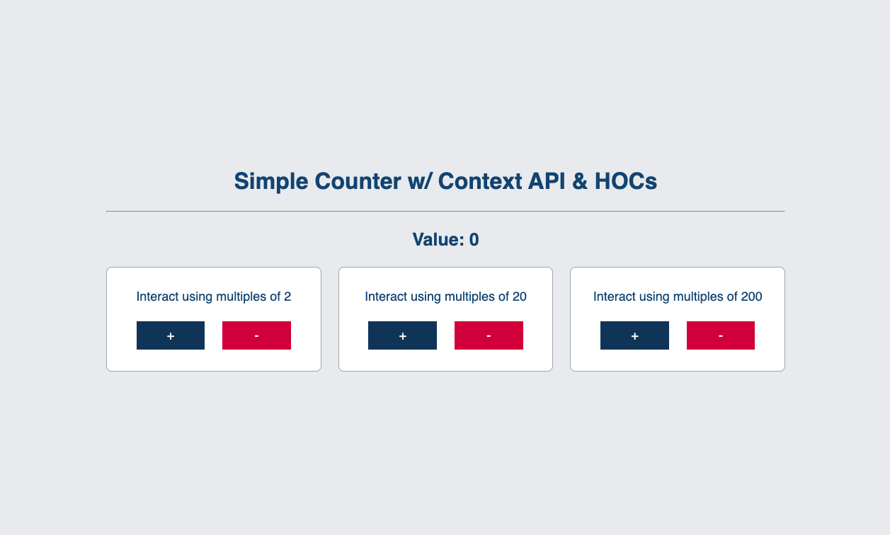

# Simple Counter with Context API & Hooks

This is a simple example of a counter feature being handled by 3 different components using React Context and Hooks.

## Screenshot



## Project Structure

```bash
├── .husky # pre-commit hooks
│   └── commit-msg # commit message convention
│   └── pre-commit # script to run ESLint, Prettier, Type Check, Cypress E2E tests and Jest Unit tests
├── .vscode # VSCode Config
│   └── extensions.json # extensions recomendations
├── cypress # Cypress end-to-end tests
│   ├── e2e # test files
│   ├── fixtures # example mocked data
│   ├── support # reusable functions
│   │   ├── commands.ts # custom commands
│   │   ├── component-index.html # component index
│   │   ├── e2e.ts # load custom commands
│   │   └── utils.tsx # Cypress util functions
├── public
├── src
│   ├── components # reusable components
│   │   ├── components.tsx # contains components A, B and C
│   │   ├── display-value.tsx # component to display the current value
│   │   ├── higher-order-component.tsx # HOC to be used on components
│   │   └── styles.ts # styled components for all components
│   ├── contexts # context providers
│   │   └── index.tsx
│   ├── pages
│   │   ├── home.tsx # page component
│   │   └── styles.ts # home page styled components
│   ├── test # Jest unit tests
│   │   ├── __tests__ # test files
│   │   │   └── app.test.tsx
│   │   └── __mocks__ # mock files
│   │      └── file-mock.ts # mock file imports
│   ├── theme
│   │   ├── global-styles.ts # global styles & reset
│   │   ├── colors.ts # palette
│   │   └── index.ts # theme default export
│   ├── app.tsx # main app component
│   ├── main.tsx # entry point
│   ├── vite-env.d.ts # vite types
│   └── setupTests.ts # setup file for Jest
├── .commitlintrc # commit message convention
├── .eslintignore # files to ignore for ESLint
├── .eslintrc # ESLint configuration
├── .gitignore # files to ignore for Git
├── .npmrc # registry configuration
├── .nvmrc # node version
├── .prettierignore # files to ignore for Prettier
├── .prettierrc # Prettier configuration
├── cypress.json # Cypress configuration
├── jest.config.js # Jest configuration
├── package.json # dependencies
├── README.md
├── tsconfig.json # TypeScript configuration
├── tsconfig.node.json # TypeScript configuration for Node
├── vite.config.ts # Vite configuration
└── yarn.lock # dependencies lockfile
```

## Setup and Installation

1. Clone the repository:

```bash
git clone https://github.com/amanda-natallie/simple-counter-with-context-api-and-hocs.git
code simple-counter-with-context-api-and-hocs # if you use VSCode (which is strongly recomended)
```

2. Install dependencies:

```bash
yarn
```

3. Start the development server:

```bash
yarn dev
```

4. Open [http://localhost:3000](http://localhost:3000) with your browser to see the result.

## Available Scripts

In the project directory, you can run:

```bash
yarn dev # Runs the app in the development mode.

yarn build # Builds the app for production to the `dist` folder.

yarn serve # Serves the production build from the `dist` folder.

yarn lint #Lints the code using ESLint.

yarn prettier #Formats the code using Prettier.

yarn type-check #Checks the types using TypeScript.

yarn test:unit #Runs unit tests using Jest.

yarn test:e2e #Runs E2E Tests using Cypress.

yarn test:e2e:open #Open the Cypress interface to run E2E Tests.

yarn test #Runs unit tests using Jest and E2E Tests using Cypress.
```

### Architecture Decisions

- [Vite](https://vitejs.dev/) was chosen as the bundler for this project because it is fast and supports React out of the box.
- [TypeScript](https://www.typescriptlang.org/) was chosen as the language for this project because it is a superset of JavaScript that provides static type checking.
- [ESLint](https://eslint.org/) was chosen as the linter for this project because
  is highly configurable and supports modern JavaScript, JSX, and TypeScript, making it a versatile tool for enforcing coding standards. Its large community, real-time feedback, and integrations with build tools make it a popular choice for maintaining code quality and consistency in projects..
- [Prettier](https://prettier.io/) was chosen as the code formatter for this project because is a highly opinionated code formatter that enforces a consistent style across my codebase, ensuring clean and readable code without manual configuration.
- [Husky](https://typicode.github.io/husky/#/) was chosen as the pre-commit hook for this project because it sets up pre-commit and pre-push hooks in my Git repository, allowing me to run tasks like linting, formatting, and testing automatically before making a commit or push.
- [CommitLint](https://commitlint.js.org/#/) was chosen as the commit message convention for this project because it enforces consistent and well-structured commit messages by applying predefined rules, improving codebase readability and facilitating effective collaboration.
- [Jest](https://jestjs.io/) was chosen as the unit testing framework for this project because it is a zero-config, all-in-one testing framework for JavaScript and TypeScript. It's designed for simplicity and speed, providing a seamless environment for writing and executing unit tests.
- [Cypress](https://www.cypress.io/) was chosen as the end-to-end testing framework for this project because it is an end-to-end testing framework that enables me to write and run automated tests for web applications. It provides a rich set of features, including real-time browser preview, debugging, and cross-browser testing capabilities.
- [React](https://reactjs.org/) was chosen as the UI library for this project because it is the most popular JavaScript UI library.
- [React Context](https://reactjs.org/docs/context.html) was chosen as the state management solution for this project because it is built into React.
